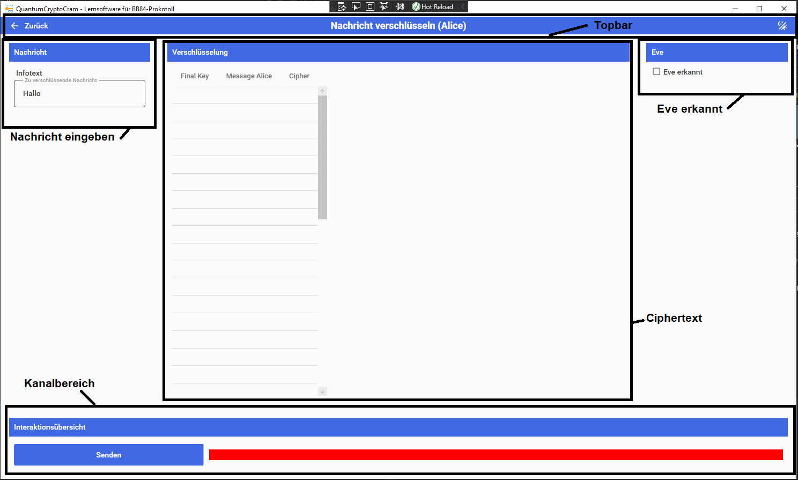

# Nachricht versenden

In dieser Oberfläche schreibt und verschlüsselt Alice ihre Nachricht und versendet diese an Bob.

## Bereiche

### Topbar

In diesem Bereich wird durch das Programm navigiert.

#### Zurück-Pfeil (Links)

Wechselt zurück in die Simulationsübersicht.

#### Name (Mitte)

Gibt den Namen der aktuellen Oberfläche an.

#### Dark/Light Mode (Rechts)

Invertiert das Farbtheme der Anwendung. Wenn es hell ist wird die Anwendung dunkel und umgekehrt.

### Nachricht eingeben

In das Textfeld wird die zu verschlüsselnde Nachricht eingegeben.

### Kanalbereich

Drücken auf den "Senden"-Button versendet die Ciphernachricht.

### Chiphertext

- FinalKey: gibt den Final Key von Alice an mit dem der eingegebene Text verschlüsselt wird.
- Message Alice: Zeigt die Nachricht an die in das Eingabefeld in "Nachricht eingeben" eingetragen wurde
- cipher: Gibt die Chiphernachricht an die aus dem Text mit dem FinalKey erstellt wurde.

### Eve erkannt

Durch das drücken der Checkbox gibt man an, dass man vermutet, dass Eve gelauscht hat. Fließt in die Auswertung mit ein.