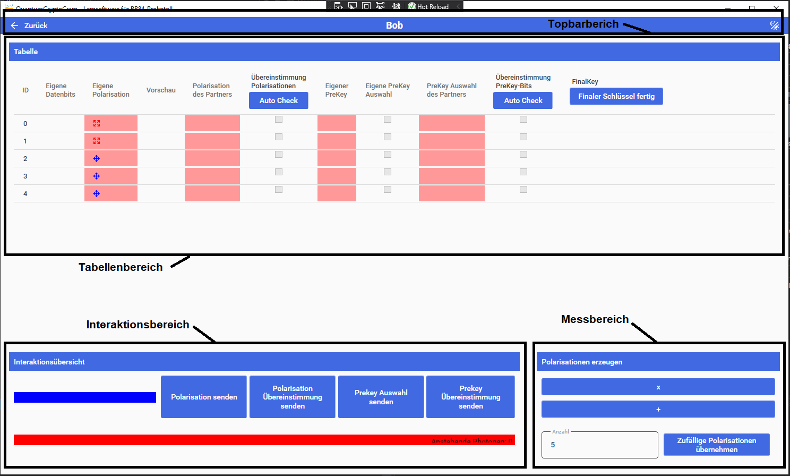

# Bob

Übersicht über die Rolle von Bob. Bob ist der empfänger der Nachricht. Er empfängt die Photonen die Alice sendet und erstellt daraus einen gemeinsamen Schlüssel mit dem er die Chiphernachricht die Alice ihm sendet entschlüsselt. Die Oberfläche ist in drei Bereiche unterteilt.

## Bereiche

### Topbar

In diesem Bereich wird durch das Programm navigiert.

### Zurück-Pfeil(Links)

Wechselt zurück in die Simulationsübersicht.

#### Name(Mitte)

Gibt den Namen der aktuellen Oberfläche an.

#### Dark/Light Mode(Rechts)

Invertiert das Farbtheme der Anwendung. Wenn es Hell ist wird die Anwendunf dunkel und umgekehrt

### Tabellenbereich

Hier werden alle Informationen die Bob zur Verfügung stehen gespeichert und angezeigt.

- ID: Identifikationsnummer des Photons
- Eigene Datenbits: Zeigt die gemessenen Datenbits der empfangenen Photonen an.
- Eigene Polarisation: Die Polarisation mit der die empfangenen Photonen gemessen wurden. Gesendete Polarisation werden mit einem Pfeil markiert. Übereinstimmungen mit den von Alice erhaltenen Polarisationen werden farbig dargestellt:
    - Rot markiert: Keine Übereinstimmung
    - Grün markiert: Übereinstimmung
- Vorschau: Aktuell ungenutzt
- Polarisation des Partners: Die von Alice empfangenen Polarisation. Übereinstimmungen mit den eigenen Polarisationen werden farbig dargestellt:
    - Rot markiert: Keine Übereinstimmung
    - Grün markiert: Übereinstimmung
- Übereinstimmung Polarisationen: Hier kann markiert werden ob die Eigenen Polarisationen mit den des Partners übereinstimmen. Die Auswahl ist nur möglich wenn beide Polarisationen im Notebook eingetragen sind. Die Auswahl wird gesperrt wenn der Eintrag zum PreKey Vergleich verwendet wurde. Mit dem "Auto Check"-Button kann der Vergleich automatisch durchgeführt werden.
- Eigener PreKey: Hier werden die Datenbits des eigenen PreKeys angezeigt. Wenn sie für den PreKey Vergleich gesendet wurden, werden sie fett markiert.
- Eigene PreKey Auswahl: Hier werden die PreKey-Bits ausgewählt die zum Vergleich an den Partner gesendet werden. PreKey-Bits werden farblich markiert.
    - Rot markiert: Keine Übereinstimmung
    - Grün markiert: Übereinstimmung
- PreKey Auswahl des Partrners: Hier wird die Auswahl an PreKeys angezeigt und farblich markiert.
    - Rot markiert: Keine Übereinstimmung
    - Grün markiert: Übereinstimmung
- Übereinstimmung PreKey-Bits:  Hier kann markiert werden ob die Eigenen mit den PreKey-Bits des Partners übereinstimmen. Die Auswahl ist nur möglich wenn beide PreKeys im Notebook eingetragen sind. Mit dem "Auto Check"-Button kann der Vergleich automatisch durchgeführt werden.
- FinalKey: Zeigt die Datenbits des eigenen FinalKey an. Zum Vergleich verwendete PreKey-Datenbist werden nicht für den Finalkey verwendet.
- "Finaler Schlüssel fertig"-Button sperrt alle Interaktionen in der aktuellen Oberfläche. Er zeigt dem Programm an dass der Schlüssel fertig erstellt wurde. In der Simulationsübersicht wird der "Nachricht versenden"-Button freigeschalten

### Messbereich

In diesem Bereich werden Photonen empfangen. Daten können gesendet oder empfangen werden. Wenn Photonen auf dem Quantenkanal anliegen und Polarisationen zum empfangen ausgewählt wurden, werden die Photonen automatisch gemessen.

#### Polarisationenen erzeugen(Rechts)

Manuelle auswahl:

- Mit dem drücken des "X" oder des "+"-Buttons wird die Polarisation zum empfangen des nächsten Photons ausgewählt.

Automatische auswahl:

- Eine belibige Anzahl an zu erzeugenenden Photonen kann im Textfeld angegeben werden
- Durch klick auf den "Zufällige Polarisationen erzegen"-Button werden die Photonen  mit zufülligem Datenbit und Polarisation erzeugt und ins Notebook eingetragen

### Interaktionsübsersicht

- "Polarisation senden"-Button: Sendet alle im Nootbook vorhandenen, noch nicht gesendeten Polaristionen über den öffentlichen Kanal.
- "Pol. Übereinstimmung senden"-Button: Sendet alle aktuell angewählten Polarisationsübereinstimmungen über den öffentlichen Kanal.
- "PreKey Auswahl senden"-Button: Sendet alle aktuell angewählten, noch nicht gesendeten PreKey-Datenbits über den öffentlichen Kanal.
- "PreKey Über. senden"-Button:  Sendet alle aktuell angewählten PreKey-Übereinstimmungen über den öffentlichen Kanal.
