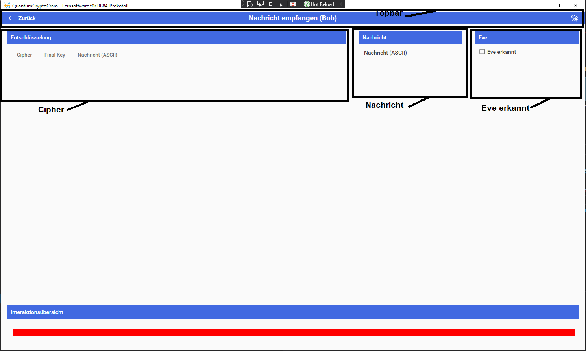

# Nachricht empfangen

In dieser Oberfläche empfängt und entschlüsselt Bob die Nachricht von Alice.

## Bereiche

### Topbar

In diesem Bereich wird durch das Programm navigiert.

#### Zurück-Pfeil (Links)

Wechselt zurück in die Simulationsübersicht.

#### Name (Mitte)

Gibt den Namen der aktuellen Oberfläche an.

#### Dark/Light Mode (Rechts)

Invertiert das Farbtheme der Anwendung. Wenn es hell ist wird die Anwendung dunkel und umgekehrt.

### Cipher

- Cipher: Zeigt die von Alice empfangene Cipher an.
- FinalKey: Zeigt Bobs FinalKey an der zum Entschlüsseln verwendet wird an.
- Nachricht(ASCII): Zeigt die entschlüsselte Nachricht in Tabellenform an.

### Nachricht

Zeigt die entschlüsselte Nachricht an.

### Eve erkannt

Durch das drücken der Checkbox gibt man an, dass man vermutet, dass Eve gelauscht hat. Fließt in die Auswertung mit ein.