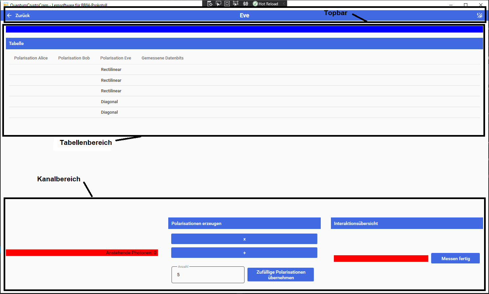

# Eve

Übersicht über die Rolle von Eve. Eve versucht den gemeinsamen Schlüssel von Bob und Alice zu erraten um die Nachricht zu entschlüsseln. Die Oberfläche ist in drei Bereiche unterteilt.

## Bereiche

### Topbar

In diesem Bereich wird durch das Programm navigiert.

#### Zurück-Pfeil(Links)

Bricht die Simulation ab und wechselt zurück ins Hauptmenü. Alle bisher eingegebenen Daten gehen verloren.

#### Name(Mitte)

Gibt den Namen der aktuellen Oberfläche an.

#### Dark/Light Mode(Rechts)

Invertiert das Farbtheme der Anwendung. Wenn es Hell ist wird die Anwendunf dunkel und umgekehrt

### Tabellenbereich

Hier werden alle Informationen die Eve zur Verfügung stehen gespeichert und angezeigt.

- Polarisation Alice: Zeigt die von Alice verwendete Polarisation die zum Photenen erzeugen verwendet wurden an
- Polarisation Bob: Zeigt die Polasrisation an die Bob zum empfangen der Photonen verwendet hat an
- Polarisation Eve: Zeigt die Polasrisation an die Bob zum empfangen der Photonen verwendet hat an
- Eves Daten: Zeigt die Datenbits an die Eve gemessen hat und markiert diese farblich:
    - rote Markierung: Keine übereinstimmungen der Polarisationen.
    - orange Markierung: Übereinstimmungen bei zwei der Polarisationen.
    - grüne Markierung: Übereinstimmung bei allen drei Polarisationen.

### Kanalberich

In diesem Bereich können Photonen empfangen werden. Dies kann automatisch oder manuel erfolgen.

Manuelle erzeugung:

- Mit drücken der "X" oder "+"-Button wird die Polarisation zum empfangen des nächsten Photons ausgeählt.

Automatische erzeugung:

- Eine belibige Anzahl an zu erzeugenenden Photonen kann im Textfeld angegeben werden
- Durch klick auf den "Zufällige Polarisationen erzegen"-Button werden die Photonen  mit zufülligem Datenbit und Polarisation erzeugt und ins Notebook eingetragen

Datenaktionen:

Die von Alice und Bob empfangenen Daten aus dem Datenkanal werden automatisch in die Spalten eingetragen.

Messen fertig:
Schließt das Messen ab und aktiviert den nachricht knacken Button in der Simulationsübersicht