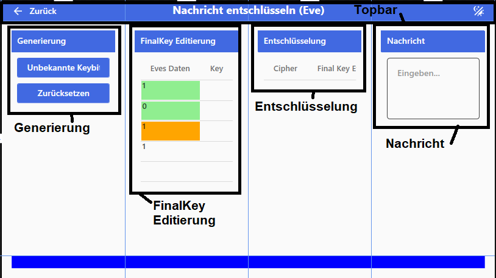

# Nachricht knacken

In dieser Oberfläche fängt Eve die Nachricht von Alice ab und versucht sie zu entschlüsseln dazu kann sie ihren Finalen schlüssel nochmals Bearbeiten.

## Bereiche

### Topbar

In diesem Bereich wird durch das Programm navigiert.

#### Zurück-Pfeil (Links)

Wechselt zurück in die Simulationsübersicht.

#### Name (Mitte)

Gibt den Namen der aktuellen Oberfläche an.

#### Dark/Light Mode (Rechts)

Invertiert das Farbtheme der Anwendung. Wenn es hell ist wird die Anwendung dunkel und umgekehrt.

### Generierung

- "Unbekannte Keybits setzen"-Button: Erzeugt für alle nicht sicheren FinalKey-Bits zufällige Werte.
- "Zurücksetzten"-Button: Setzt alle FinalKey-Bits außer die sicheren zurück.

### FinalKey Editierung

- "Eves Daten": Zeigt an welches Datenbit Eve an dieser Stelle gemessen hat und markiert sie farblich anach anzahl der übereinstimmungen.
    - grün: Alle drei Polarisationen stimmen überein.
    - orang: Nur zwei der Polarisationen stimmen überein.
    - rot: Diese Bit wurde zum PreKey vergleich genutzt und ist nicht mehr Teil des FinalKeys.
- "Key": Zeigt Eves FinakKey an es werden nur die grünen werte übernommen. Alle anderen können Händisch eingetragen werden oder mit "Unbekannte Keybits setzen"-Button automatisch erzeugt werden.

### Entschlüsselung

- Cipher: Zeigt die von Alice empfangene verschlüsselte Nachricht an.
- FinalKey Editiert: Zeigt den bearbeiteten Final Key von Eve an.

### Nachricht

Zeigt die entschlüsselte Nachricht an.