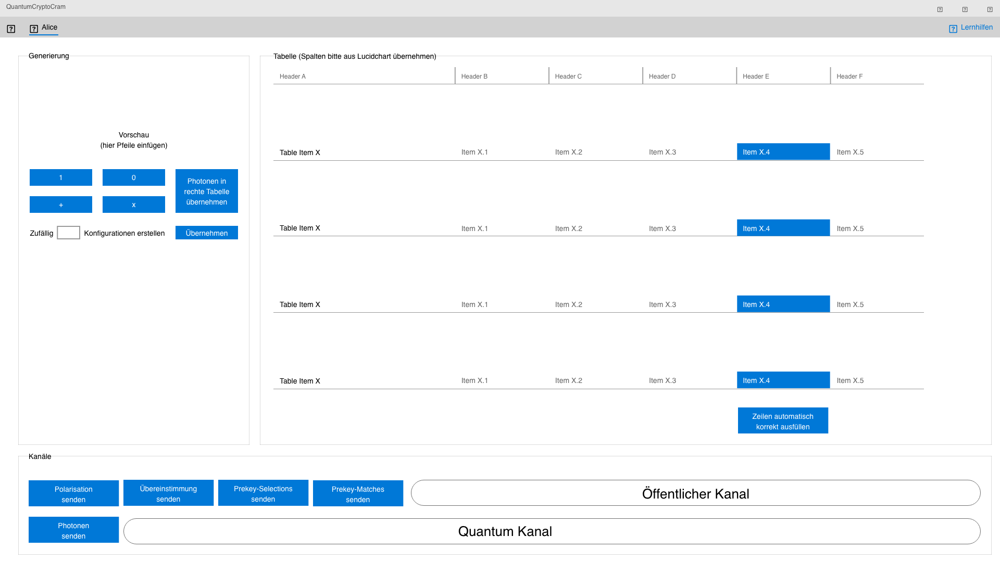
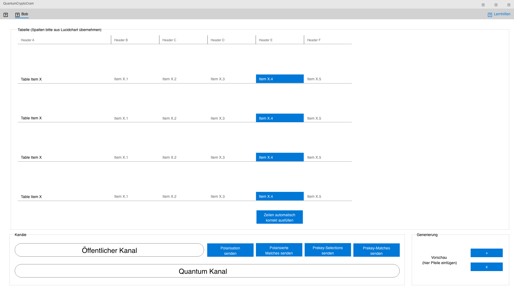
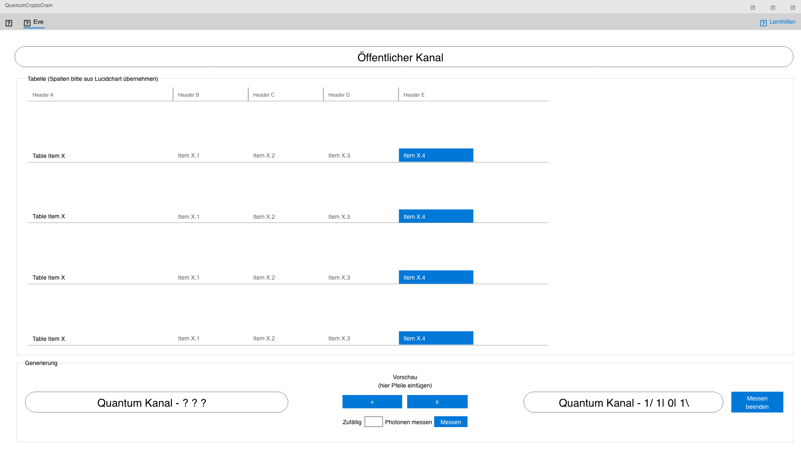
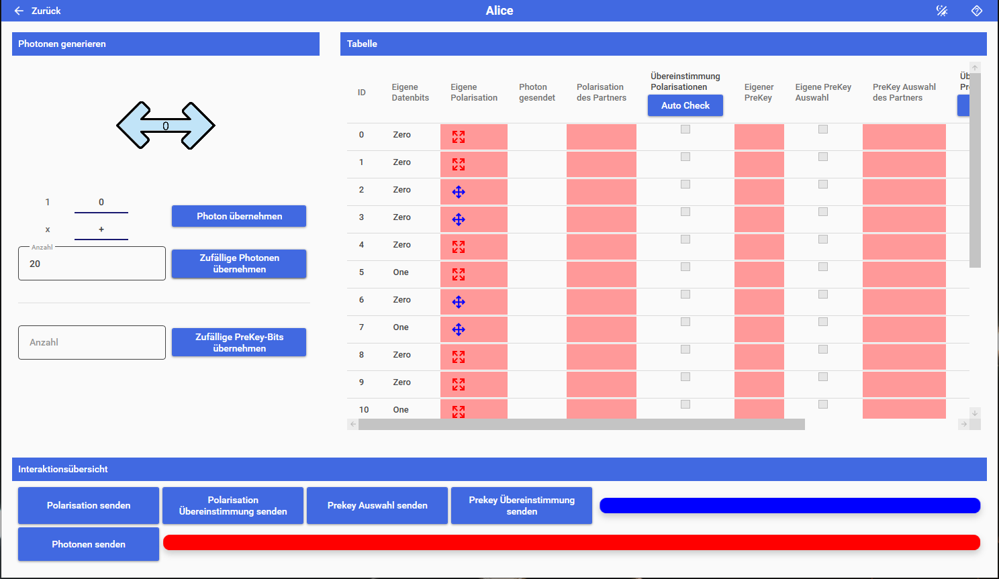

# IMPORTANT NOTE
8372 ist my alias on the gitlab server of my universtity so odnt be confused that the original commiter doesnt match

# QuantumCryptoCram

"QuantumCryptoCram" ist eine Lernsoftware zur Quantenkryptographie, um den Nutzer das BB-84-Protokoll näher zu bringen.
Der Name des Projektes setzt sich aus zwei Teilen zusammen.
Der erste Teil „QuantumCrypto“ ist eine Abkürzung für Quantenkryptographie.
Der zweite Teil „Cram“ ist eine englische Bezeichnung für intensives Lernen.
Der Name bedeutet also, sich intensiv mit Methoden der Quantenkryptographie zu beschäftigen.
Im Folgenden wird „QuantenCryptoCram“ mit QCC abgekürzt.

## Bilder des Oberflächenentwurfs

Dies sind die entworfenen Rollenoberflächen für das fertige Programm, an der sich die Entwicklung orientiert.

### Oberflächenentwurf: Alice

### Oberflächenentwurf: Bob

### Oberflächenentwurf: Eve

## Bilder der aktuellen Oberflächen

Hier wird der aktuelle Stand der Rollenoberflächen präsentiert (Aktueller Stand: Milestone T8)

Oberfläche: Alice

Oberfläche: Bob

Oberfläche: Eve

Oberfläche der Auswertung:

---
## Milestones

Strukturierte Liste aller Entwicklungsaufgaben bzw. Änderungen sind in Milestonse unterteilt.
Liste aller Milestones:
[Milestones](https://git.oth-aw.de/swp/sose2021/team_c/quantumcryptocram/-/milestones?sort=due_date_desc&state=all)